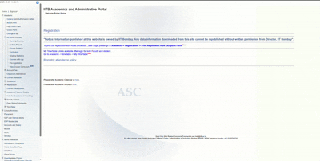

# ASC Grade Helper - Chrome Extension

**ASC Grade Helper** is a browser extension designed to enhance the experience of students at **IIT Bombay** by automating the tedious process of fetching and analyzing course grading statistics from the Application Software Centre (**ASC**).  

This tool provides a modern, user-friendly interface to quickly visualize and compare grade distributions for multiple courses across several years, saving students valuable time during course registration and academic planning.

---

## ✨ Features

- **Batch Processing**: Fetch grade statistics for multiple courses at once.  
- **Multi-Year & Semester Support**: Input course codes and select specific semesters over the last four academic years.  
- **Rich Data Visualization**: View grade distributions as clean, grouped bar charts for easy comparison between different sections.  
- **Interactive Charts**: Hover over bars to see exact student counts for each grade, with data labels displayed directly on the chart.  
- **Persistent History**: Your search history is automatically saved. Quickly re-display charts for previously searched courses with a single click.  
- **User Control**: A **"Clear History"** button gives you full control over your saved data.  
- **Seamless Automation**: Works reliably with the ASC portal by simulating real user actions in its frames.  

---

## ⚙️ How It Works

The extension uses an **In-Page Automation** architecture.  

When you request grade stats, a script is injected into your active, logged-in ASC portal page. This script:  

1. Takes your list of courses, years, and semesters.  
2. Programmatically clicks the **"Grading statistics"** link in the menu frame.  
3. For each course, fills out the search form and submits it.  
4. Waits for the results page to load in the content frame and scrapes the grade table HTML.  
5. After all courses are processed, navigates the content frame back to its original page.  
6. Sends the collected data back to the popup, where it is parsed and rendered as charts.  

✅ This method is robust as it works within the website’s complex frameset structure and respects its security measures by automating real user actions.

---

## 🛠️ Technology Stack

- **Frontend**: HTML5, CSS3, JavaScript (ES6+)  
- **Charting**: Chart.js with the Datalabels plugin  
- **Core**: Chrome Extension APIs (Manifest V3), including scripting and storage  

---

## 🚀 Setup & Installation

To install and run this extension locally:

1. Download or clone this repository to your local machine.  
2. Open Google Chrome and navigate to `chrome://extensions`.  
3. Enable **Developer mode** using the toggle in the top-right corner.  
4. Click the **Load unpacked** button.  
5. Select the project folder (`/extension`) where you saved the files.  
6. The extension icon will now appear in your browser’s toolbar.  

---

## 📖 How to Use

1. Log in to the **ASC portal** as you normally would.  
2. Navigate to a page where the left-hand menu is visible (e.g., the **"Running Courses"** page).  
3. **Important**: Manually expand the **"Academic"** and **"All About Courses"** menus so that the **"Grading statistics"** link is visible.  
4. Click the extension’s icon in your toolbar to open the popup.  
5. Enter one or more course codes in the table and select the desired semesters. Use the **"+ Add Course"** button for multiple entries.  
6. Click **"Get All Stats"**. The charts will appear in the popup below.  
7. Use the **"Previous Searches"** links for quick access to past results.  

---
## 🤝 Contributing

Contributions are welcome! If you’d like to help improve **ASC Grade Helper**, please follow these steps:
1. **Fork** the repository  
2. **Create a new branch** (`git checkout -b feature/YourFeatureName`)  
3. **Commit your changes** (`git commit -m 'Add some feature'`)  
4. **Push to the branch** (`git push origin feature/YourFeatureName`)  
5. Open a **Pull Request**

---

⭐ If you find this project helpful, consider giving it a **star** on GitHub — it helps others discover it too!
